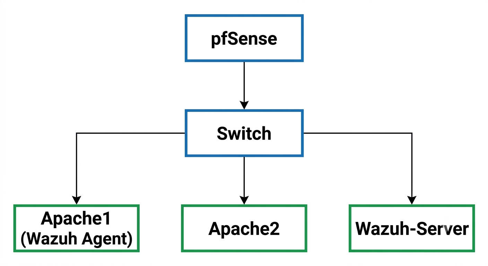
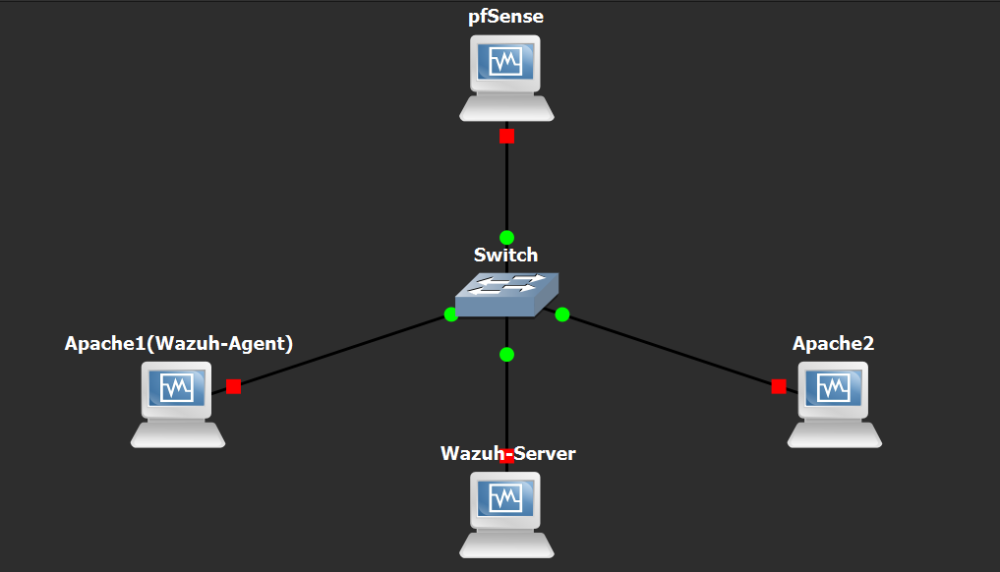
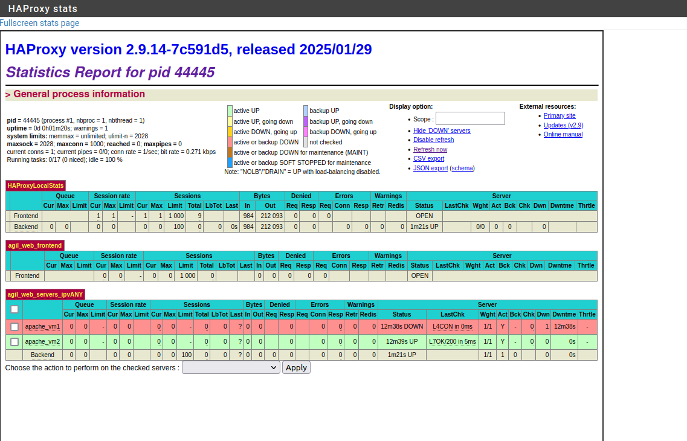
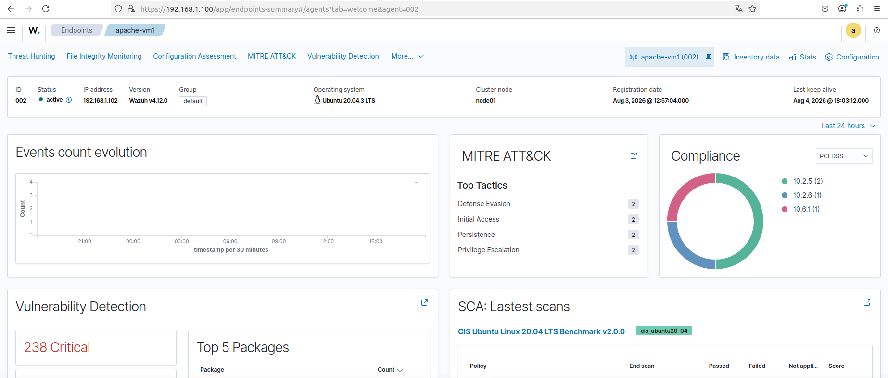

# 🛡️ Wazuh SOC Lab

<h3 align="center">
Enterprise-like SOC Infrastructure Simulation using Wazuh SIEM, pfSense Firewall, HAProxy Load Balancing and GNS3
</h3>

<p align="center">
A cybersecurity laboratory designed to simulate a Security Operations Center (SOC) environment by integrating security monitoring, network protection, and high availability services.
</p>

<p align="center">


</p>

---

# 📸 Lab Preview

## Network Topology

<p align="center">



</p>

The complete SOC laboratory topology showing:

- pfSense firewall and router
- Internal network switch
- Apache1 web server with Wazuh Agent
- Apache2 secondary web server
- Wazuh SIEM server

---

## GNS3 Implementation

<p align="center">



</p>

The infrastructure was simulated using GNS3 with virtual machines connected through a virtual network environment.

---

## HAProxy Load Balancing

<p align="center">



</p>

HAProxy dashboard showing backend server monitoring and availability status.

---


## Wazuh Agent Monitoring

<p align="center">



</p>

Apache1 successfully registered as a monitored endpoint in the Wazuh platform.

---

# 📌 Project Overview

The **Wazuh SOC Lab** is a virtual cybersecurity infrastructure built to reproduce a simplified enterprise Security Operations Center environment.

The project combines:

- Security Information and Event Management (SIEM)
- Firewall protection
- Load balancing
- Web service availability
- Network simulation

The objective is to demonstrate the integration between security monitoring and network infrastructure components.

The entire environment was deployed using **GNS3** and **VirtualBox**.

---

# 🏗️ Lab Architecture

The infrastructure contains:

| Component | Role |
|-----------|------|
| pfSense | Firewall, gateway and HAProxy load balancer |
| Apache1 | Web server + Wazuh monitored endpoint |
| Apache2 | Secondary web server for failover |
| Wazuh Server | SIEM platform and security monitoring |
| GNS3 | Network topology simulation |

---

# 🌐 Network Topology

```
                         Internet
                            |
                         pfSense
                  Firewall + HAProxy
                            |
                         Switch
          _________________|_________________
         |                 |                |
      Apache1           Apache2       Wazuh Server
   (Wazuh Agent)      (Web Server)      (SIEM)
```

---

# ⚙️ Implemented Components

## 🔥 pfSense Firewall

pfSense was deployed as the main network security component.

Implemented:

- Network routing
- Firewall configuration
- Internal network communication
- HAProxy integration

Documentation:

```
docs/04-pfSense-Configuration.md
```

---

# ⚖️ HAProxy Load Balancing

HAProxy was configured on pfSense to provide high availability for Apache services.

Implemented:

- Frontend configuration
- Backend configuration
- Health checks
- Automatic failover

Traffic flow:

```
Client
   |
   v
HAProxy Frontend
   |
   v
HAProxy Backend
   |
   +-------------+
   |             |
   v             v
Apache1       Apache2
```

Normal operation:

```
Apache1  → UP

Apache2  → UP
```

Failure scenario:

```
Apache1  → DOWN

Apache2  → ACTIVE
```

Documentation:

```
docs/05-HAProxy-Configuration.md
```

Configuration:

```
configs/pfsense/

├── haproxy-frontend.md
└── haproxy-backend.md
```

---
# 🌍 Service Access

The services are accessed through the following endpoints:

| Service | Access |
|---------|--------|
| pfSense WebGUI | https://<pfSense-IP> |
| HAProxy Frontend | http://<pfSense-IP>:8080 |
| HAProxy Statistics | http://<pfSense-IP>:8404 |
| Apache1 | Internal backend server on port 80 |
| Apache2 | Internal backend server on port 80 |

Users access the web service through HAProxy instead of directly accessing Apache servers.
HAProxy distributes requests between Apache1 and Apache2 and provides automatic failover.

---
# 🖥️ Apache Web Servers

Two Apache servers were deployed as HAProxy backend nodes.

## Apache1

Role:

- Primary web server
- Wazuh monitored endpoint

Integrated components:

- Apache2 web server
- Wazuh Agent

Configuration:

```
configs/apache/apache1-config.md
```

---

## Apache2

Role:

- Secondary web server
- High availability backend

Configuration:

```
configs/apache/apache2-config.md
```

---

# 🛡️ Wazuh SIEM Deployment

The Wazuh platform was deployed on Ubuntu Server.

Components installed:

- Wazuh Manager
- Wazuh Indexer
- Wazuh Dashboard

The Wazuh Agent was installed on Apache1 to collect endpoint security events.

Architecture:

```
Apache1

    |
    |
Wazuh Agent

    |
    |
Wazuh Manager

    |
    |
Wazuh Dashboard
```

Documentation:

```
docs/

├── 06-Wazuh-Server-Installation.md
└── 07-Wazuh-Agent-Installation.md
```

Configuration:

```
configs/wazuh/

├── ossec.conf
├── agent.conf
└── manager-notes.md
```

---

# 🧪 Testing and Validation

## HAProxy Failover Test

A high availability test was performed.

### Test Scenario

1. Apache1 and Apache2 were running.
2. Client accessed the service through HAProxy.
3. Apache service was stopped on Apache1.
4. HAProxy detected Apache1 failure.
5. Traffic continued through Apache2.

Result:

```
Apache1  → DOWN

Apache2  → ACTIVE

Web Service → AVAILABLE
```

The test validated successful automatic failover.

Documentation:

```
docs/08-Testing-and-Validation.md
```

---

# 📂 Repository Structure

```
Wazuh-SOC-Lab/

├── README.md
├── LICENSE
├── .gitignore

├── docs/
│   ├── 01-Project-Overview.md
│   ├── 02-Lab-Architecture.md
│   ├── 03-GNS3-Setup.md
│   ├── 04-pfSense-Configuration.md
│   ├── 05-HAProxy-Configuration.md
│   ├── 06-Wazuh-Server-Installation.md
│   ├── 07-Wazuh-Agent-Installation.md
│   ├── 08-Testing-and-Validation.md
│   ├── 09-Troubleshooting.md
│   └── 10-Future-Improvements.md
│
├── configs/
│   ├── pfsense/
│   │   ├── haproxy-frontend.md
│   │   └── haproxy-backend.md
│   │
│   ├── wazuh/
│   │   ├── ossec.conf
│   │   ├── agent.conf
│   │   └── manager-notes.md
│   │
│   └── apache/
│       ├── apache1-config.md
│       └── apache2-config.md
│
├── screenshots/
│   ├── topology.png
│   ├── gns3.png
│   ├── haproxy-dashboard.png
│   ├── backend-online.png
│   ├── backend-failover.png
│   ├── wazuh-agent.png
│   └── wazuh-dashboard.png
│
└── assets/
    └── architecture.png
```

---

# 🧰 Technologies Used

| Technology | Purpose |
|------------|---------|
| Wazuh | SIEM and security monitoring |
| pfSense | Firewall and network security |
| HAProxy | Load balancing and failover |
| Apache2 | Web server services |
| Ubuntu Server | Linux infrastructure |
| GNS3 | Network simulation |
| VirtualBox | Virtualization |

---

# 🎯 Skills Demonstrated

## Cybersecurity

- SIEM deployment
- Security monitoring
- Log analysis
- Endpoint monitoring

## Network Security

- Firewall configuration
- Network segmentation
- Load balancing
- High availability design

## Infrastructure

- Linux administration
- Virtualization
- Network simulation
- Service deployment

---

# 🚀 Future Improvements

Planned enhancements:

- Integrate Suricata IDS/IPS
- Add Windows endpoint monitoring with Sysmon
- Create custom Wazuh detection rules
- Add attack simulation scenarios
- Automate deployment using Ansible
- Expand SOC monitoring capabilities

---

# 👤 Author

**Oussema Jemmali**

Cybersecurity Engineering Student

Focus areas:

- SOC Operations
- Network Security
- SIEM Technologies
- Firewall Administration
- Infrastructure Security

---

# 📜 License

This project is licensed under the MIT License.