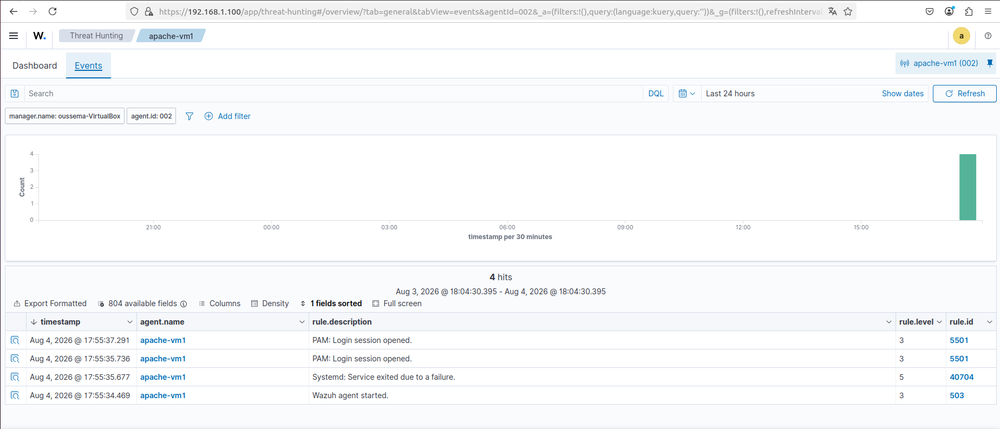

# 🛡️ Wazuh SOC Lab

<h3 align="center">
Enterprise-like SOC Infrastructure Simulation using Wazuh SIEM, pfSense Firewall, HAProxy Load Balancing and GNS3
</h3>

<p align="center">
A cybersecurity laboratory designed to simulate a Security Operations Center (SOC) environment by integrating SIEM monitoring, firewall protection, high availability services, and network simulation.
</p>

<p align="center">


</p>

---

# 📸 Lab Preview

## Network Topology

<p align="center">


</p>

The complete SOC laboratory topology showing:

- pfSense firewall and router
- Internal network switch
- Apache1 web server with Wazuh Agent
- Apache2 secondary web server
- Wazuh SIEM server

---

## GNS3 Implementation

<p align="center">


</p>

The infrastructure was simulated using GNS3 with virtual machines connected through an internal network environment.

---

## HAProxy Load Balancing

<p align="center">


</p>

HAProxy dashboard showing backend server monitoring and availability status.

---

## Wazuh Agent Monitoring

<p align="center">


</p>

Apache1 successfully registered as a monitored endpoint in the Wazuh platform.

---

## Wazuh SIEM Alert Detection

<p align="center">



</p>

Wazuh Dashboard displaying HAProxy availability events received from pfSense through Syslog and detected using custom rules.

---

# 📌 Project Overview

The **Wazuh SOC Lab** is a virtual cybersecurity infrastructure built to reproduce a simplified enterprise Security Operations Center environment.

The project combines:

- Security Information and Event Management (SIEM)
- Firewall protection
- Load balancing and high availability
- Centralized log collection
- Security event detection
- Network simulation

The objective is to demonstrate the integration between security monitoring and network infrastructure components.

The entire environment was deployed using **GNS3** and **VirtualBox**.

---

# 🏗️ Lab Architecture

The infrastructure contains:

| Component | Role |
|-----------|------|
| pfSense | Firewall, gateway and HAProxy load balancer |
| Apache1 | Web server + Wazuh monitored endpoint |
| Apache2 | Secondary web server for failover |
| Wazuh Server | SIEM platform and security monitoring |
| GNS3 | Network topology simulation |

---

# 🌐 Network Topology

```
                         Internet
                            |
                         pfSense
                  Firewall + HAProxy
                            |
                         Switch
          _________________|_________________
         |                 |                |
      Apache1           Apache2       Wazuh Server
   (Wazuh Agent)      (Web Server)      (SIEM)
```

---

# ⚙️ Implemented Components

# 🔥 pfSense Firewall

pfSense was deployed as the main network security component.

Implemented:

- Network routing
- Firewall configuration
- Internal network communication
- HAProxy integration
- Syslog forwarding to Wazuh

Documentation:

```
docs/04-pfSense-Configuration.md
```

Configuration:

```
configs/pfsense/

├── haproxy-frontend.md
├── haproxy-backend.md
└── syslog-wazuh.md
```

---

# ⚖️ HAProxy Load Balancing

HAProxy was configured on pfSense to provide high availability for Apache services.

Implemented:

- Frontend configuration
- Backend configuration
- Health checks
- Automatic failover
- Logging integration

Traffic flow:

```
Client
   |
   v
HAProxy Frontend
   |
   v
HAProxy Backend
   |
   +-------------+
   |             |
   v             v
Apache1       Apache2
```

Normal operation:

```
Apache1 → UP

Apache2 → UP
```

Failure scenario:

```
Apache1 → DOWN

Apache2 → ACTIVE
```

Documentation:

```
docs/05-HAProxy-Configuration.md
```

---

# 🌍 Service Access

The services are accessed through:

| Service | Access |
|---------|--------|
| pfSense WebGUI | https://<pfSense-IP> |
| HAProxy Frontend | http://<pfSense-IP>:8080 |
| HAProxy Statistics | http://<pfSense-IP>:8404 |
| Apache1 | Internal backend server |
| Apache2 | Internal backend server |

Users access web services through HAProxy instead of directly accessing Apache servers.

HAProxy distributes requests between Apache1 and Apache2 and provides automatic failover.

---

# 🖥️ Apache Web Servers

Two Apache servers were deployed as HAProxy backend nodes.

## Apache1

Role:

- Primary web server
- Wazuh monitored endpoint

Integrated components:

- Apache2 web service
- Wazuh Agent

Configuration:

```
configs/apache/apache1-config.md
```

---

## Apache2

Role:

- Secondary web server
- High availability backend

Configuration:

```
configs/apache/apache2-config.md
```

---

# 🛡️ Wazuh SIEM Deployment

The Wazuh platform was deployed on Ubuntu Server.

Components installed:

* Wazuh Manager
* Wazuh Indexer
* Wazuh Dashboard

The Wazuh Agent was installed on Apache1 to collect endpoint security events.

Additionally, pfSense was integrated with Wazuh using remote Syslog forwarding to collect HAProxy and firewall events.

## Architecture

```
Apache1
   |
Wazuh Agent
   |
Wazuh Manager
   |
Wazuh Dashboard


pfSense
   |
   +------------------+
   |                  |
HAProxy Logs      Firewall Logs
   |                  |
   +--------+---------+
            |
       Syslog UDP 514
            |
      Wazuh Manager
            |
   Custom Detection Rules
            |
      Wazuh Dashboard
```

## Implemented

* Wazuh SIEM deployment
* Wazuh Agent monitoring
* Remote Syslog collection
* HAProxy event monitoring
* pfSense firewall event monitoring
* Custom Wazuh detection rules
* Dashboard alert visualization

## Documentation

```
docs/

├── 06-Wazuh-Server-Installation.md
├── 07-Wazuh-Agent-Installation.md
└── 08-Testing-and-Validation.md
```

## Configuration

```
configs/wazuh/

├── ossec.conf
├── agent.conf
├── local_rules.xml
└── manager-notes.md
```

---

# 🧪 Testing and Validation

The laboratory was tested through multiple scenarios to validate high availability, log collection, event detection, and SIEM monitoring.

## HAProxy Failover Test

Scenario:

1. Apache1 and Apache2 were running.
2. The client accessed the web service through HAProxy.
3. The Apache2 service was stopped.
4. HAProxy detected the Apache2 failure.
5. The web service remained available through Apache1.

Result:

```
Apache2 → DOWN

Apache1 → ACTIVE

Web Service → AVAILABLE
```

The test confirmed that HAProxy provides automatic failover between the Apache backend servers.

---

## Wazuh HAProxy Detection Test

The integration between pfSense HAProxy and Wazuh SIEM was validated.

Workflow:

```
Apache Server Failure
        |
        v
HAProxy Health Check
        |
        v
HAProxy Syslog Event
        |
        v
Wazuh Manager
        |
        v
Custom Detection Rule
        |
        v
Wazuh Dashboard Alert
```

Detected events:

* Backend server DOWN
* Backend server UP
* Service recovery
* Backend availability changes

The events were successfully received by Wazuh and displayed as alerts in the Wazuh Dashboard.

Documentation:

```
docs/08-Testing-and-Validation.md
```

---

## pfSense Firewall Event Detection Test

A firewall event was generated to verify the integration between pfSense and Wazuh.

A temporary firewall rule was configured on pfSense to block TCP port 9999.

Test command:

```
nc -vz -w 3 192.168.1.1 9999
```

The blocked connection generated a pfSense filterlog event.

Workflow:

```
Wazuh Server
      |
      | TCP connection attempt
      v
pfSense Firewall
      |
      | Block
      v
pfSense filterlog
      |
      | Syslog UDP 514
      v
Wazuh Manager
      |
      | Custom Detection Rule
      v
Wazuh Dashboard Alert
```

The Syslog traffic was verified using:

```
sudo tcpdump -i any -A udp port 514
```

The event was also verified in the Wazuh archives:

```
sudo tail -f /var/ossec/logs/archives/archives.log
```

The test confirmed that:

* pfSense successfully generated a firewall event.
* The event was forwarded to Wazuh using Syslog.
* Wazuh successfully received the filterlog event.
* A custom Wazuh rule detected the event.
* The firewall event appeared as an alert in the Wazuh Dashboard.

Result:

```
pfSense Firewall Event → DETECTED

Syslog Transmission → PASS

Wazuh Detection Rule → PASS

Wazuh Dashboard Alert → PASS
```

---

# 📂 Repository Structure

```
Wazuh-SOC-Lab/

├── README.md
├── LICENSE
├── .gitignore

├── docs/
│   ├── 01-Project-Overview.md
│   ├── 02-Lab-Architecture.md
│   ├── 03-GNS3-Setup.md
│   ├── 04-pfSense-Configuration.md
│   ├── 05-HAProxy-Configuration.md
│   ├── 06-Wazuh-Server-Installation.md
│   ├── 07-Wazuh-Agent-Installation.md
│   ├── 08-Testing-and-Validation.md
│   ├── 09-Troubleshooting.md
│   └── 10-Future-Improvements.md
│
├── configs/
│   ├── pfsense/
│   │   ├── haproxy-frontend.md
│   │   ├── haproxy-backend.md
│   │   └── syslog-wazuh.md
│   │
│   ├── wazuh/
│   │   ├── ossec.conf
│   │   ├── agent.conf
│   │   ├── local_rules.xml
│   │   └── manager-notes.md
│   │
│   └── apache/
│       ├── apache1-config.md
│       └── apache2-config.md
│
├── screenshots/
│   ├── topology.png
│   ├── gns3.png
│   ├── haproxy-dashboard.png
│   ├── wazuh-agent.png
│   ├── wazuh-dashboard.png
│   ├── haproxy-apache1-failure-test.png
│   └── wazuh-apache1-recovery-alert.png
```

---

# 🧰 Technologies Used

| Technology    | Purpose                                |
| ------------- | -------------------------------------- |
| Wazuh         | SIEM and security monitoring           |
| pfSense       | Firewall, routing and network security |
| HAProxy       | Load balancing and high availability   |
| Apache2       | Web server services                    |
| Ubuntu Server | Linux infrastructure                   |
| GNS3          | Network simulation                     |
| VirtualBox    | Virtualization                         |

---

# 🎯 Skills Demonstrated

## Cybersecurity

* SIEM deployment
* Security monitoring
* Log analysis
* Custom detection rules
* Alert investigation
* Centralized log collection

## Network Security

* Firewall configuration
* Syslog integration
* Network segmentation
* Load balancing
* High availability design
* Network event monitoring

## Infrastructure

* Linux administration
* Virtualization
* Network simulation
* Service deployment
* Infrastructure monitoring

---

# 🚀 Future Improvements

Planned enhancements:

* Integrate Suricata IDS/IPS
* Add Windows endpoint monitoring with Sysmon
* Add attack simulation scenarios
* Extend pfSense firewall detection rules
* Add more custom Wazuh detection rules
* Automate deployment using Ansible
* Implement DMZ and internal network segmentation
* Expand SOC monitoring capabilities

---

# 👤 Author

**Oussema Jemmali**

Cybersecurity Engineering Student

Focus areas:

* SOC Operations
* Network Security
* SIEM Technologies
* Firewall Administration
* Infrastructure Security

---

# 📜 License

This project is licensed under the MIT License.
